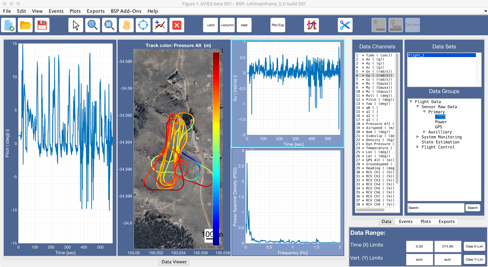

# kVIS3 -- Kai's Data visualisation and manipulation tool (3rd edition)

## Management and visualisation of time sampled experimental data with emphasis on flight test data in Matlab

*kVIS3 is released under the GPL V3 license.*

Inspired by the SIDPAC GUI by E.A. Morelli.

## Features:
(list WiP)
- present large amount of data groups and channels in an accessible tree structure
- supports non-uniform sample rates between data groups
- data set trimming
- marking of significant time points in the data with events
- definition of quickly accessible custom plots
- export data in freely defined formats 

## How to run:

kVIS3 requires a *Board Support Package (BSP)*, specified in the preferences file, to import and process data from the user's data acquisition system. This split allows for kVIS to be open source, while potentially dealing with propriatry data. All data specific functionality is provided by the BSP, and therefore kVIS3 by itself will not launch (or be able to do anything).

Freely available BSP's are:

- [ArduPilot](https://github.com/flyingk/kVIS3_bsp_ardupilot)
- tbd.

Run 'kVIS3.m' after installing the two toolboxes in the `Contributed` folder and creating a `kVIS_preferences.m` file from the provided template. In the `kVIS_preferences.m` file specify the path to the BSP folder containing the `BSP_ID.m` file.

## Additional information:

Refer to the [help](https://flyingk.github.io/kVIS3/) for a user manual and coding information. (WiP)

Development of kVIS3 supported by The University of Sydney, School of AMME, and Lilium GmbH. 

### External Contributions:
kVIS3 relies on the following external contributions:

- [Matlab GUI Layout Toolbox](https://www.mathworks.com/matlabcentral/fileexchange/47982-gui-layout-toolbox)
- [Matlab Widgets Toolbox](https://www.mathworks.com/matlabcentral/fileexchange/66235-widgets-toolbox)
- [Plot Google Maps](https://github.com/zoharby/plot_google_map)
- [Icons](https://icons8.com)

Thanks for sharing!

## Created and copyright by Matt Anderson Ph.D. and Kai Lehmkühler Ph.D.
