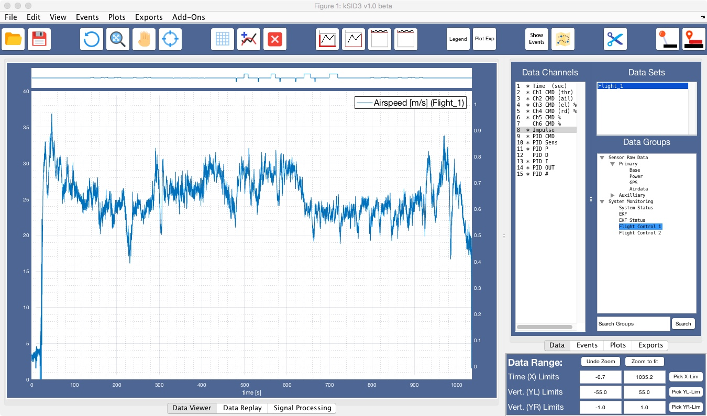

DATA VIEWER:
===========================

## UI Controls Ribbon:

### Open FDS:
Function: Open an existing `FDS` file from disk.

Implementation: Use `uiopen` to get file name

### Save FDS:
Function: Save `FDS` file to previous location, if exists (**Replaces existing file - Use Save As in menu to save to new location**). If file has not been saved before, prompt for save location. 

Implementation: Save to previous location by overwriting without confirmation prompt. Prompt for new location, if file is from import operation and has not been saved.

### Undo Zoom:
Function: Restore plot limits to state prior last zoom operation. 

### Fit: 
Function: Zoom all axes to fit the plotted data (identical to `Reset Limits` button in `Data Range`)

Implementation: Sets `XLim`, `YLim` properties of all plots to `[min(XData) max(XData)]`, `[min(YData) max(YData)]`, and update fields in `Data Range`.

### Pan: 
Function: Enables native Matlab pan function

*CAN (WANT) we update Data Range while scrolling?? Or copy new limits after finish scrolling?*

### Data Cursor: 
Function: Enables native Matlab data cursor function

### Grid: 
Function: Shows/hides grid in main axes

### Hold: 
Function: Add lines to existing plot when depressed ('hold on') -- applies to selected axis

### Clear: 
Function: Clear and reset all axes

Implementation: 
- Clear and reset axes to default style, hide second Y axis. 
- Keep content of `Data Range` fields to enable creation of a new plot within the same limits. 
- Set/keep grid according to button state.
- Clear hold button.
- Select Main Axis L

### Next Plot Axes:
- Main L: Select left y-axis in main plot 
- Main R: Select right y-axis in main plot
- Top: Select upper, secondary axes (meant for status flags and other channels that do not require scale)
- Top2: Select upper, secondary axes with data coloured by value (Modes, booleans) details TBD.

### Legend: 
Function: Show/hide legend (right click on legend allows to change its formatting)

### Plot Export: 
Function: Export main axes to new figure (for saving/printing)

*Export all axes? Or even print to pdf directly?*

### Show Events: 
Function: Show overlay with event locations

### Map: 
Function: show google map with data overlay in separate window. For details see the [Map Viewer](User-Interface/left/MapViewer) page.

### Cut:
Function: Applies a cut at the defined X-limits. This will edit the content of the entire data set:
- **All** data channels will be cut to new time limits
- `FDS` attributes are updated to reflect the change
- `Data Range` is reset to limits of new data range

The edit is performed **IN MEMORY** only. The user has to **manually** save the new `FDS` to conserve the edit. An `Apply and Save` function is available in the menu to combine the steps.

### Set Time Reference:
Function: Defines currently selected data set as the time reference. Other data sets can then be aligned to the reference by specifying time offsets.

Implementation: 

### Set Time Offset:
Function: Define a time offset relative to the previously defined master data set. Plots of this offset dataset will be moved in time to reflect the offset.

Implementation: Write specified time offset value into the `Offset` attribute of the `FDS` structure. Indicate offset value in `Data Sets` list in front of the name.

## UI Controls Plot:

- Right click on a plot line: Opens context menu to inspect/highlight/edit/delete that line.

## UI Controls Data Tab:

See [Data Tab](Edit-Tabs/1 Data Tab) page.

## UI Controls Data Range:

### Reset Lim:
Function: Reset plot limits to XData, YData range in plot for all axes. Identical to `Fit` button in ribbon.

### Time Limits:
Function: Specify X-axis range for all plots (*incl. custom plots??*)
-  Enter values directly into the input fields. **Enter** updates plot(s)
-  `Pick X-Lim` button: Use crosshairs in the plot to specify new limits

Implementation:
- Ensure correct handling of wrong order input values

*How to handle abort of crosshair input??*

### Vertical (L/R) Limits:
Function: Specify Y-axis range for left and right axis (independently)
-  Enter values directly into the input fields. **Enter** updates plot(s)
-  `Pick Y(L/R)-Lim` button: Use crosshairs in the plot to specify new limits for selected axis

Implementation:
- Ensure correct handling of wrong order input values

*How to handle abort of crosshair input??*

## Dev. Notes:

- basic legend implemented, uses auto-update feature

- TeX rendering broken; to fix this, we probably need to create a legend for an empty plot at startup, then switch `Interpreter` to `latex`, set lines' `DisplayName` to TeX version.