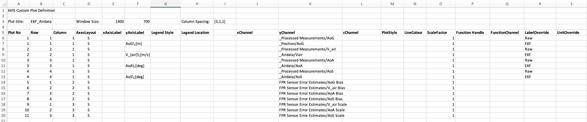

# File Formats for Custom Plot Definition.

## Excel format

[](img/custom_plot_def.jpeg)

- Save as .xlsx into CustomPlots folder of BSP

- Header format, including column labels (Rows 1-5), must not be changed

- The group/channel identifier(s) can be generated from the right click context menu  -> copy to clipboard in the kVIS3 channel list.

- Note: due to a limitation in the gui layout toolbox, the generated plots cannot be saved as a .fig file. An option to export the plot into a normal Matlab figure (loosing some layout functions) is provided.

### Editable Fields:

#### Header:

- Plot title: Name of plot to be listed in kVIS3

- Window Size: Plot window size in pixels

#### Plot Definition Rows:

- Plot No: Number of plot for given definition column. Must be increasing and cannot have gaps. Repeated plot numbers will produce a single plot with multiple lines. 
- Row: Plot stack row to place plot into

- Column: Plot stack column to place plot into 
- AxesLayout: S for single y axis, L and R for double y axis. Plot definition must have a left y axis.

- xAxisLabel: Override plot x label. Provide a valid LaTeX string. Leave empty for defaults. 
- yAxisLabel: Override plot y label. Provide a valid LaTeX string. Leave empty for defaults.

- LegendStyle: horizontal or vertical. Default: Matlab default 
- LegendLocation: valid Matlab legend location string

- Report Figure Label (Column I, not shown in above figure): Figure label used during report generation

- xChannel: data to use for plot x axis (default: time). Must have the same sample rate (number of points) as yChannel. Format: group Name / channel Name
- yChannel: data to use for plot y axis. Format: group Name / channel Name

- cChannel: if specified, xy plot becomes a scatter plot with cChannel used as colour for the data points. Must have the same sample rate (number of points) as yChannel. Format: group Name / channel Name
- LineStyle: valid Matlab line style specifier (-, .-, .. and so on)

- LineColour: valid line colour spec character (‘k’)
- ScaleFactor: Scale yChannel by this value

- FunctionHandle: function handle to process yChannel data. Must be on path, typically provided by BSP in a CustomPlotFcn folder. See [plot function page](plotFcn.md)

- FunctionChannel: Comma separated string of arbitrary arguments for above function, must be compatible with the function definition.

- LabelOverride: Specify new label for yChannel (appears in plot labels and legends). Provide a valid LaTeX string. Leave empty for defaults.

- UnitOverride: Specify a new unit for yChannel (appears in plot labels and legends). Provide a valid LaTeX string. Leave empty for defaults.

## Legacy m file format

Kept for compatibility, use for new plots is discouraged.

The plot definition is structured as a cell array. The file content except the actual plot definition rows must equal to the structure shown in the example below.

All plots are generated against the time vector on the X-axis.

Plots are arranged using Matlab subplots().

### Plot layout fields:

- Row

- Col

- AxesLayout for Y axis

- PlotStyle: standard Matlab plot style shortcuts (solid, dashed,…)

- Color: standard Matlab line colour definition

### Plot entry fields:

- Group: tree group of data channel

- Channel: data channel name

- ScaleFactor: constant scale factor applied to the data during plot generation

- UnitOverride: new unit after scale factor application

### Example:

```
plot_definition = {...
    Row, Col, AxesLayout, PlotStyle, Color,     Group,        Channel, ScaleFactor, UnitOverride;
      1,   1,        'S',        '',    '',    'Base',           'Az',            1,          '';
      2,   1,        'S',        '',    '',    'Base',           'Gy',       180/pi,     'deg/s';
      3,   1,        'S',        '',    '',    'Base',          'AoA',            1,          '';
      4,   1,        'S',        '',    '',    'Base',        'Pitch',            1,          '';
      5,   1,        'L',        '',    '',    'Base',     'Elevator',            1,          '';
      5,   1,        'R',        '',    '', 'Control', 'Ch3 CMD (el)',            1,          '';
    };
CUSTOM_PLOTS.(BSP_NAME).Base = plot_definition;
```